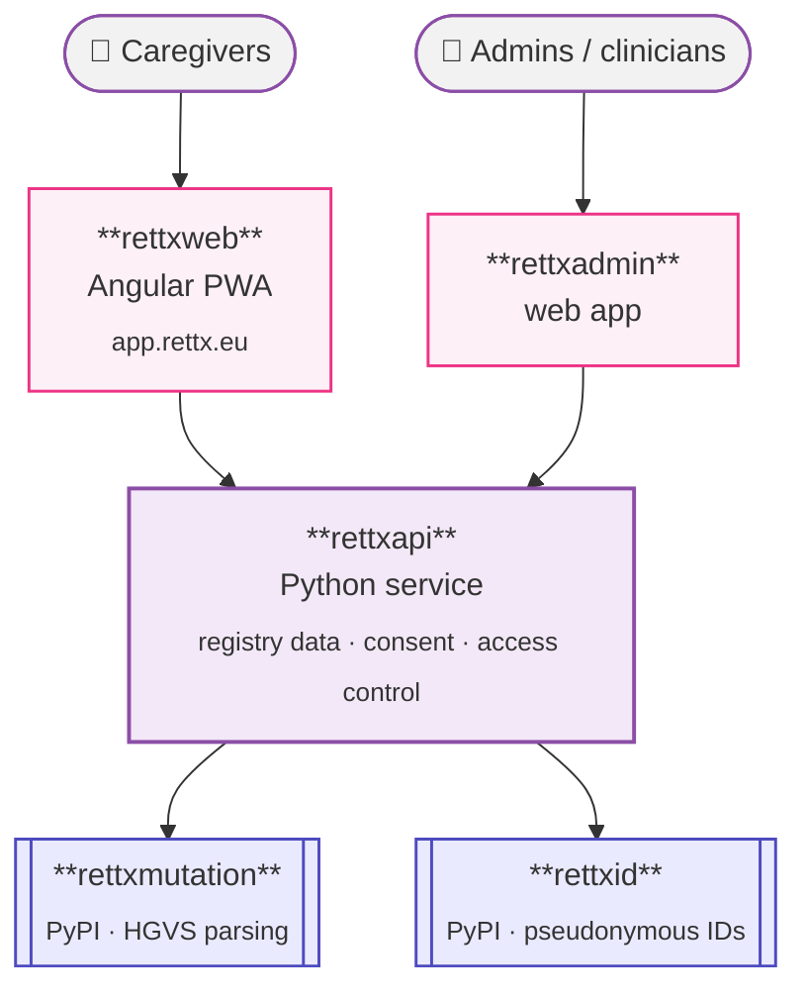

This page is a high-level orientation. Deeper dives live alongside it
under the **Architecture** section as they are written.

## Layers

rettX is intentionally small for a healthcare system. There are three
runtime layers and two supporting libraries:

## Trust boundaries

- The **caregiver app** and the **admin app** never see another
  patient's data. All authorisation is enforced server-side in
  `rettxapi`.
- `rettxapi` is the only component that touches identifiable data at
  rest. Pseudonymous identifiers come from `rettxid`; mutation strings
  are normalised through `rettxmutation`.
- The **docs site** (this site) and the **WordPress landing site** at
  `rettx.eu` are static and have no access to patient data.

## How changes flow

For anything that crosses a trust boundary or affects more than one
component, we write a **specification** in
[`specs/`](https://github.com/rett-europe/rettx/tree/main/specs)
before any code is written. The spec must pass a constitution check
(see [governance](/governance/constitution/)) before tasks are fanned
out to the relevant repositories.

## What lives where

See the [ecosystem map](/welcome/ecosystem/) for which repository
holds what, and which are public versus private.

## More to come

This section will grow as we publish ADRs and architecture deep dives.
Watch the [decisions](/decisions/) section for newly-merged ADRs.
