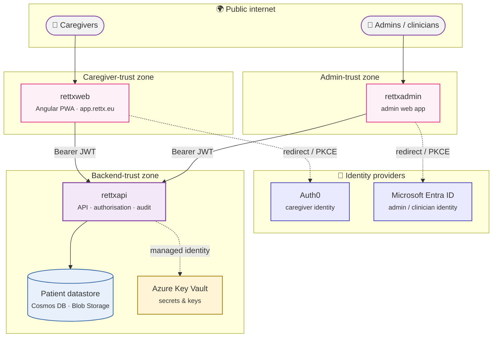
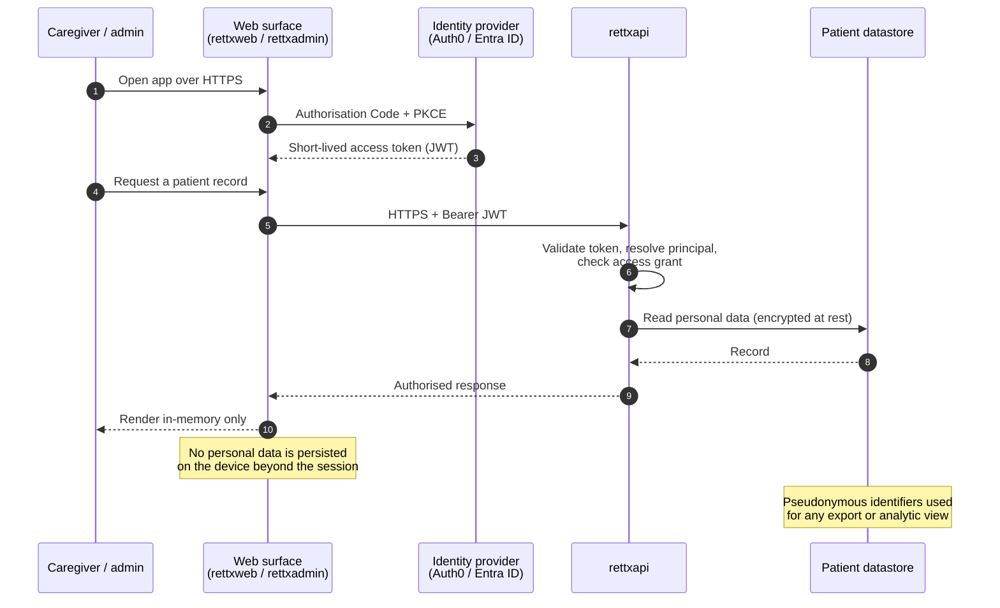
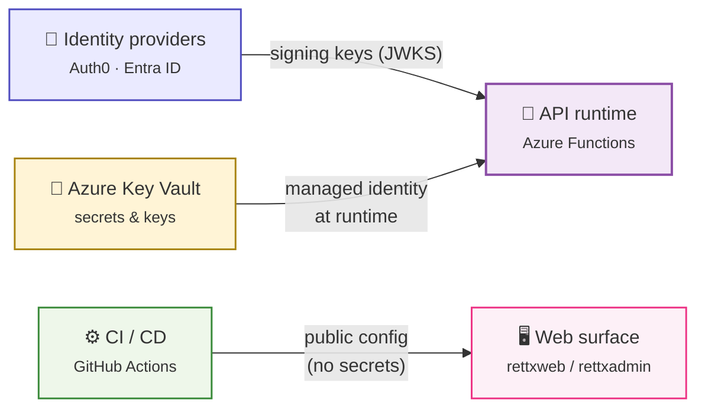

rettX is a patient registry for people living with Rett Syndrome. It
processes special-category personal data within the meaning of the EU
General Data Protection Regulation, and the families who entrust their
records to it are the reason the program exists. This page is the
program-level statement of how that data is protected: the controls
that are in place, the boundaries those controls defend, and the way
the pieces of the system fit together. It is the public answer to
constitution principles
[II — Privacy by design](/governance/constitution/#ii-privacy-by-design-non-negotiable),
[III — Transparency above all](/governance/constitution/#iii-transparency-above-all-non-negotiable),
and [VI — Security baseline](/governance/constitution/#vi-security-baseline),
and it is intended to be readable end to end by a clinician, an
auditor, or a security-minded family in under ten minutes.

## The trust boundaries

The diagram below shows who interacts with the registry, which
components hold which data, and where one trust zone ends and another
begins. Each boundary is a place where authentication is re-established
and authorisation is re-checked.

The caregiver app and the admin app sit in distinct trust zones and
never speak to each other. Each one establishes its user's identity
through a federated provider — Auth0 for caregivers, Microsoft Entra
ID for admins and clinicians — and then presents a short-lived bearer
token to `rettxapi`. The API is the only component that crosses into
the backend-trust zone where patient records live. No client-side
component is ever the authoritative source of an authorisation
decision.

## How personal data flows

Personal data moves between these zones only along a small number of
well-defined paths. Where it does cross a boundary, it is in transit
under TLS and bound to an authenticated principal on each end.

Three classes of data travel along these paths. **Authentication
material** — the access token and refresh token issued by the
identity provider — is held by the web surface and sent on each call
to the API. **Personal data** lives in the backend datastore and is
returned to the surface only for the records the signed-in principal
is explicitly granted access to. **Pseudonymous exports** —
research-style or analytic views — never carry direct identifiers;
they reference patients by the opaque identifier issued by `rettxid`.

## How secrets and keys flow

Credentials and signing material follow a separate path that never
touches source code or build artefacts.

Backend secrets live in Azure Key Vault and are read by the API at
runtime through a managed identity — there is no copy of those values
in source, in environment files, or in build logs. The web surfaces
ship with only public configuration (the OAuth client identifier, the
API URL, the public half of the Web Push key pair); they hold nothing
that would be useful to an attacker who obtained the bundle. Token
signing keys originate at the identity providers and are fetched by
the API via the providers' published JWKS endpoints.

## Controls in place

The eight subsections below mirror the canonical questionnaire that
each ecosystem repository answers in its own `SECURITY.md`. They
describe the program-level posture; per-repo detail lives in those
files.

### 1. Authentication & authorisation

Identity is federated. Caregivers authenticate against Auth0 using the
Authorisation Code flow with PKCE, with sign-in options that include
passwordless email, password, and Google social login. Admins and
clinicians authenticate against Microsoft Entra ID, also using
Authorisation Code with PKCE, and must be explicitly provisioned in
the program's tenant before they can sign in at all. Neither web
surface holds a client secret; PKCE removes the need for one.

The web surfaces use the claims they receive only to drive the user
interface. Every privacy-relevant or integrity-relevant decision is
re-checked server-side: the API validates the token's signature,
audience, and expiry on every request, resolves the caller to a
principal, and consults a per-patient access grant before returning
any record. A signed-in caregiver sees only the patients explicitly
granted to them; an admin token, once revoked at the identity
provider, can no longer be used against the API.

### 2. Data at rest

Identifiable patient data lives only in the backend tier. It is held
in Azure Cosmos DB (structured records — demographics, mutations,
survey responses, audit events, access grants) and Azure Blob Storage
(uploaded medical files). All of it is encrypted at rest using
platform-managed keys backed by FIPS 140-2 Level 2 validated hardware
security modules. Blob containers are private; direct file access
requires a short-lived signed URL.

The web surfaces are not systems of record. They keep an
authentication token cache in browser storage so a caregiver does not
have to sign in on every page reload, and they keep transient UI state
in memory; nothing beyond that lands on the device. Pseudonymous
identifiers from `rettxid` are used wherever a patient must be
referenced in a URL, an export, or an analytic view, so direct
identifiers are not propagated outside the backend. Deletion is a
soft-delete that hides the record from reads while preserving the
audit trail required by healthcare regulation.

### 3. Data in transit

Every connection between a user, a web surface, an identity provider,
and the API is HTTPS with a minimum of TLS 1.2. The Azure platform
that hosts the API and the static web surfaces enforces TLS-only;
plain HTTP is not accepted. Calls from the API into managed Azure
services (Cosmos DB, Blob Storage, Key Vault) use the official Azure
SDKs over HTTPS.

The web surfaces attach the bearer token only to allow-listed origins
— the API and, for the admin app, the Microsoft Graph profile
endpoint. Direct browser uploads of medical files do not carry the
bearer token; instead the API issues a short-lived signed URL scoped
to a single landing container, and the upload is authorised by that
signature alone. Cross-origin policy is configured server-side and
enumerates the trusted front-end origins explicitly.

### 4. Secrets & key management

Production secrets — database connection material, identity-provider
client secrets used by the API, third-party API keys, the private half
of the Web Push key pair, and the key material used to derive
pseudonymous identifiers — live in Azure Key Vault. The API reads them
at runtime through a system-assigned managed identity that has only
the permissions it needs. There is no copy of any of these values in
source, in committed environment files, or in build artefacts.

The web surfaces hold no confidential secrets. The values baked into
their bundles — the OAuth client identifier, the API URL, the
Application Insights connection string, the public half of the Web
Push key pair — are public by the design of the protocols that use
them. CI/CD substitutes those public values into the build through
GitHub Actions secrets that are scoped to the deploy environment and
not echoed in build logs. The API logs and the front-end telemetry
pipelines redact the `Authorization` header before any request
metadata is forwarded to observability backends.

### 5. Audit logging

The API writes a tamper-resistant audit record for every
privilege-relevant action on patient data: file uploads, validation
decisions, identity locking and unlocking, care-profile generation,
patient lifecycle events, and email dispatch. Each record carries a
timestamp, the acting principal, a correlation identifier that joins
events from the same request, the outcome, and a domain-specific
payload. Records are stored in an append-only container partitioned
per patient; the repository layer exposes no update or delete path.

The web surfaces emit operational telemetry — page views, error
traces, named user events — to Application Insights for diagnostics,
not for compliance audit. Personal and clinical data are stripped
before send by an explicit redaction layer; the browser is never
trusted as a point of compliance record.

### 6. GDPR — lawful basis, data-subject rights, retention

Patient demographics, genetic mutations, uploaded medical files, and
survey responses are processed on the basis of explicit consent under
GDPR Article 6(1)(a), paired with Article 9(2)(h) (provision of care
and health research) for the special-category content. Audit logs are
held under Article 6(1)(c), the controller's legal obligation to
demonstrate accountability. Each consent the registry records is
pinned to the immutable identifier of the privacy-policy version and
language the caregiver actually agreed to, so the program can show,
years later, exactly what was consented to.

Data-subject rights are operationally supported. Caregivers can view
the full record the registry holds about the patients they care for,
correct demographic fields, raise a moderated change request when a
field is locked for clinical reasons, withdraw consent, and request
erasure; erasure cascades through related records and is realised as
a soft-delete that retains the audit trail required by healthcare
regulation. Patient data is held in EU/EEA Azure regions in line with
the program's residency policy.

### 7. Dependencies & supply chain

Every repository pins its dependency tree. The Python services use
`pip-tools`, with high-level constraints in `requirements.in` and a
fully resolved, hash-verified `requirements.txt`; CI installs from
that lockfile. The Angular surfaces commit `package-lock.json` and
build with `npm ci`, so a build is reproducible from the lockfile
alone. Major-version upgrades of any dependency that touches
authentication, telemetry, or cryptography are gated on an explicit
review.

Vulnerabilities are surfaced through GitHub Dependabot at the
organisation level and through `npm audit` and `pip check` in the
build feedback loop. CodeQL static analysis runs on pull requests via
the program's cross-cutting workflows, and findings are addressed
before merge.

### 8. Incident response

The program operates a single, program-wide vulnerability disclosure
channel (see below). Suspected incidents are triaged by the on-call
maintainer, who can revoke a compromised credential at the identity
provider, rotate a backend secret in Key Vault, and force a redeploy
within minutes. Forensic queries against the audit log allow the
scope of any unauthorised access to be reconstructed by acting
principal, by patient, and by time window.

If personal data is or may have been exposed, the program follows the
GDPR Article 33 path: assessment of risk to the rights and freedoms
of data subjects, notification to the supervisory authority within
72 hours where the threshold is met, and notification to affected
individuals where the risk is high. Every incident closes with a
blameless review, and the structural fixes that come out of it are
tracked as their own changes in the affected repositories.

## Per-repository pointers

Each ecosystem repository keeps its own detailed `SECURITY.md` next
to its code. The aggregate above is the program-level reference; the
files below are the source of truth for each component's specifics.

| Repo | Role | Detailed `SECURITY.md` |
|------|------|------------------------|
| `rettxweb` | Caregiver web app (Angular PWA) | <https://github.com/rett-europe/rettxweb/blob/main/SECURITY.md> |
| `rettxadmin` | Admin web app | <https://github.com/rett-europe/rettxadmin/blob/main/SECURITY.md> |
| `rettxapi` | API and data services (Python) | <https://github.com/rett-europe/rettxapi/blob/main/SECURITY.md> |
| `rettxmutation` | HGVS parsing library (PyPI) | <https://github.com/rett-europe/rettxmutation/blob/main/SECURITY.md> |
| `rettxid` | Pseudonymous identifier library (PyPI) | <https://github.com/rett-europe/rettxid/blob/main/SECURITY.md> |

The five ecosystem repositories are currently private, in line with
constitution principle VII; the linked `SECURITY.md` files are
visible to those with access to the repositories, and this page is
the public reference. The two pure libraries (`rettxmutation` and
`rettxid`) hold no personal data and run no servers; their security
posture is dependency hygiene and a careful API surface.

## How to report a vulnerability

If you believe you have found a security issue anywhere in the rettX
program — in any of the five ecosystem repositories or in the public
documentation site — please email **<dpo@rettx.eu>** rather
than opening a public issue. A short report is fine; the more of the
following you can include, the faster we can act:

- the surface affected (URL, app, or package),
- the steps to reproduce,
- what you observed and what you expected,
- your assessment of severity and impact, if you have one.

We aim to acknowledge every report within **five working days**, and
we work with reporters under coordinated disclosure: we agree a
timeline, fix the issue, and credit the reporter when the fix ships,
unless the reporter prefers to remain anonymous. This single channel
applies to every repository in the program; none of the per-repo
`SECURITY.md` files invent their own contact, so a reporter never has
to guess where to send a finding. Responsible reports are warmly
welcomed.

## Constitution alignment

This page is the public answer to four principles of the
[rettX program constitution](/governance/constitution/):

- **[II — Privacy by design](/governance/constitution/#ii-privacy-by-design-non-negotiable).**
  The data-flow and the section on GDPR show that data is minimised,
  pseudonymised by default for any export, and subject to operational
  data-subject rights — not just legal claims.
- **[III — Transparency above all](/governance/constitution/#iii-transparency-above-all-non-negotiable).**
  This page itself is the manifestation of the principle: a public,
  end-to-end account of how the registry protects what it holds,
  citing each ecosystem repository's own posture.
- **[VI — Security baseline](/governance/constitution/#vi-security-baseline).**
  Federated identity, server-side authorisation, secrets in Key Vault,
  TLS everywhere, and a tamper-resistant audit log are the baseline
  this principle requires; the controls above are how that baseline
  is realised.
- **[VII — Open by default, private only when justified](/governance/constitution/#vii-open-by-default-private-only-when-justified).**
  Posture is published here; gap analyses, threat-model details, and
  remediation backlogs stay in the originating private repositories,
  exactly as the principle's "posture vs. gaps" clause requires.
