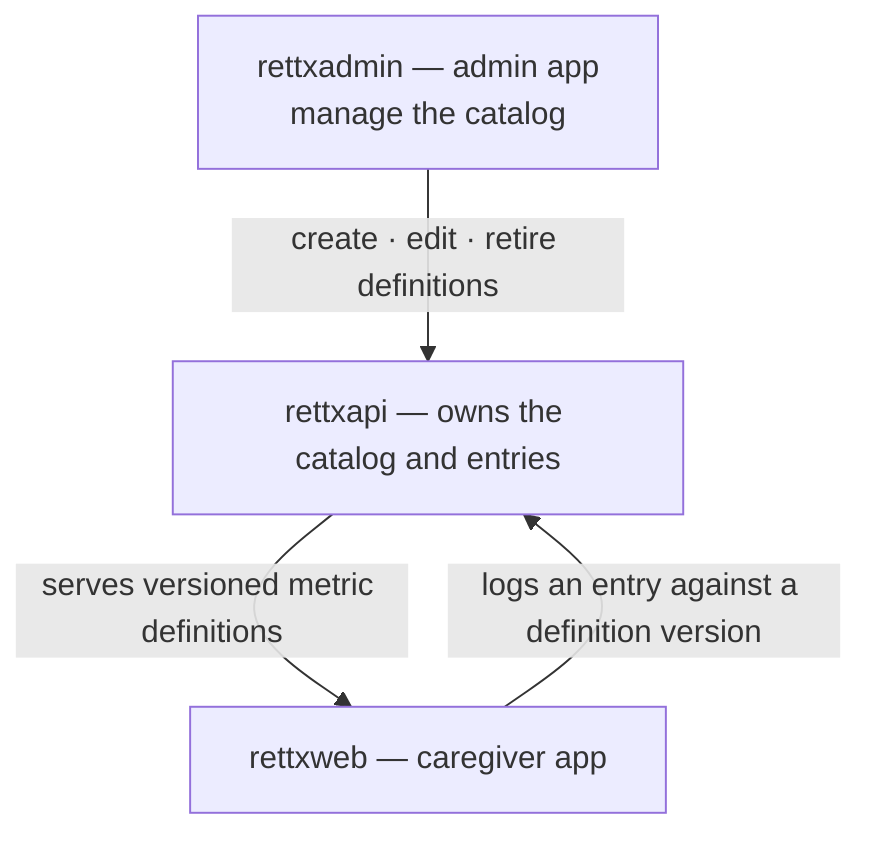

**rettX Pulse** lets a caregiver keep a simple, private record of everyday
health observations about their person with Rett syndrome — seizures,
medication, sleep, bathroom, menstrual cycle, side effects, and anything else —
on a calendar, so they can look back over time and prepare for a doctor's visit.

Pulse is a caregiver's private notebook, not a clinical system. It is
deliberately **not a medical device** and **not an emergency tool** — in an
emergency, caregivers should always contact their local emergency services.

## Who it is for

The user is a caregiver — a parent or family member — not a clinician, and
often non-technical. Pulse is designed for three moments, in priority order:

1. **Capture in the moment** — "she just had a seizure", "gave the 8am dose".
   Loggable in seconds, one-handed. Speed and forgiveness come first.
2. **Routine daily logging** — bathroom, a scheduled medication, a period.
   Habitual and low-friction, ideally one to three taps.
3. **Looking back** — "what happened over the last three months?" Calm,
   review-oriented, scanning for patterns before a consultation.

## How Pulse is built: the metric catalog

Pulse is **generic**. Rather than hard-coding one screen per health topic,
every trackable thing is composed from a small set of reusable **value
primitives**. A caregiver picks a metric, and only that metric's fields appear —
never a blank, generic form.

### Value primitives

| Primitive | What it captures | Example |
|---|---|---|
| **Occurrence** | Whether something simply happened | "A seizure occurred" |
| **Count** | A whole number | Number of bathroom visits |
| **Scale (1–5)** | A rating or severity | Seizure severity |
| **Duration** | A length of time | How long a seizure lasted |
| **Category** | A choice from a fixed set of options | Stool type; flow level |
| **Dose** | An amount with a unit | 250 mg |
| **Short text** | A brief free-text value | A medication's name |
| **Note** | Optional free-text notes | "unusually tired afterwards" |

Every entry also carries a **date** (defaulting to today) and an optional
**time**. Nothing else is mandatory — an entry can be saved with almost nothing
and details added later.

### Seed metrics

Six ready-made metrics ship as presets. Each is a composition of the primitives
above; caregivers and administrators can also build custom metrics from the same
building blocks.

| Metric | Code | Built from |
|---|---|---|
| Bathroom | `bathroom` | Category · Category · Note |
| Medication | `medication` | Short text · Dose · Note |
| Menstrual cycle | `menstrual-cycle` | Count · Category · Note |
| Seizure | `seizure` | Occurrence · Duration · Scale (1–5) · Note |
| Side effect | `generic-side-effect` | Scale (1–5) · Count · Category · Note |
| Sleep | `sleep` | Duration · Scale (1–5) · Count · Category · Note |

### Versioning

Each metric definition is **versioned**. Editing a metric publishes a *new*
version rather than mutating the old one; entries that were already logged keep
the version they were recorded against. History therefore never changes
retroactively — a chart of past seizures is not rewritten because the seizure
metric was later adjusted. (The menstrual-cycle preset, for example, is
currently at version 2.)

## What the caregiver sees

Pulse lives as an item in the app navbar and is always scoped to one patient.
It has three views:

- **Calendar** (home) — a month grid where days with entries show a subtle
  marker. A persistent, thumb-reachable **＋ Log** button is the single most
  important control. Tapping a day reveals that day's entries.
- **Timeline** — a reverse-chronological list of all entries across metrics,
  with filters (date range, metric, has-note) and note search.
- **Metrics** — each metric's own history over a time range, plus light
  management of which metrics are tracked. This is the "prepare for the doctor"
  surface.

The critical flow is **quick-log**: tap ＋ Log, pick a metric, fill only the few
fields that matter, and save — targeting three taps or fewer for a simple
metric.

### Menstrual cycle: one entry per period

A period is recorded as a **single, start-anchored, always-editable** entry: a
start date plus a duration in days (pre-filled to a sensible default). There is
no separate "end" event — closing or correcting a period is just an edit of the
one record. This avoids periods that are left "ongoing forever" when an end is
never logged.

## How administrators manage the catalog

The metric catalog is **global** — a single source of truth, owned by the
backend and administered from the rettX admin app. Administrators can view every
definition, edit a metric's labels or fields, translate labels into supported
locales, retire a metric, or add a new one from the value primitives. Every such
change publishes a new version, so live caregiver data is never disturbed.

This replaced an earlier state in which the catalog effectively existed in three
hand-maintained copies (backend, caregiver app, admin tool) that could drift
apart. The catalog is now defined once and consumed everywhere.

## Scope

Pulse ships in phases. **Phase 1 (pilot)** covers structured text/number
logging and in-app review. The following are intentionally **out of scope for
the pilot** and planned for later phases:

- Photo and video attachments
- PDF export for consultations
- Advanced charts, trends, and analytics

## Related work

The Pulse feature is specified across several cross-cutting specifications in
this control plane — the Pulse tracker (spec 035), the global metric-catalog
administration (spec 036), the menstrual start-and-duration model (spec 037),
and sleep tracking (spec 038) — each fanned out to the caregiver app, admin app,
and backend.
