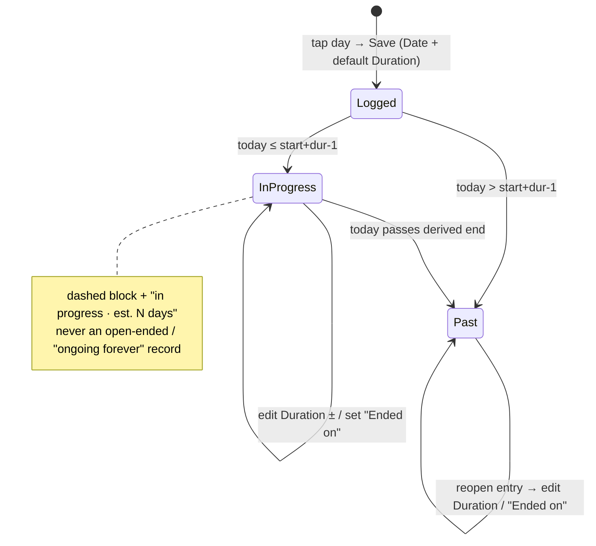

<!--
  Frontmatter below is machine-read by .github/workflows/spec-fanout.yml when
  this spec is merged into main. The `fanout` array drives which downstream
  repos get a `[spec/<slug>] <title>` issue with the `squad` label. Fanout only
  runs when `status:` is `ready` or `accepted` — while this is `draft` nothing
  fans out, so it is safe to review and iterate. Flip `status: ready` (the single
  switch) when the spec is agreed and you want the squad issues opened on merge.

  Allowed fanout repos: rettxweb, rettxadmin, rettxapi, rettxmutation, rettxid, templates.

  SEQUENCING PRE-FLIGHT (patterns.md §7): rettxapi is the CONTRACT OWNER and must
  land first — it validates every entry's fields against a server-side seed
  definition, so the client cannot start sending the new `duration-days` field
  until the seed def accepts it. rettxweb follows once the contract is live.
-->
---
spec_id: "037"
slug: "pulse-menstrual-duration"
title: "rettX Pulse — Menstrual Period as Start + Duration"
status: ready   # draft | ready | accepted | superseded
authored: "2026-07-22"
author: "perocha"
source_issue: "rett-europe/rettxweb#231"
relates_to: "specs/035-pulse-tracker/"
supersedes_requirement: "specs/035-pulse-tracker FR-005b + milestone M4 (menstrual Started/Ended span model)"
fanout:
  - repo: rettxapi
    summary: |
      CONTRACT OWNER — land this FIRST. The backend validates every pulse entry's
      fields against a server-side seed definition and runs its own menstrual
      derivation, so the whole model change is anchored here.

      Today (`app/models/pulse/seed_presets.py`) the `menstrual-cycle` seed defines
      a REQUIRED `cycle-event` category field with options `started`/`ended`
      (+ optional `flow`). Entry create/update
      (`app/services/pulse_services/pulse_tracker_entry_services.py`) rejects any
      unknown `field_key`, primitive mismatch, invalid option, or missing required
      field against that seed — so a client sending a numeric `duration-days` while
      the seed still requires `cycle-event` gets a **400**. A hardcoded server-side
      derivation (`app/services/pulse_services/menstrual_derivation.py`, exposed at
      `GET /v2/patients/{rettxid}/pulse/metrics/menstrual-cycle/cycles`) pairs
      `started`/`ended` events into cycles.

      Do:
      (1) Redefine the `menstrual-cycle` seed preset: REMOVE the `cycle-event`
      field and its `started`/`ended` options; ADD a REQUIRED integer field
      `duration-days` (primitive `count`, unit "days", min 1, sane max e.g. 15);
      keep `flow` (optional) and the note field. A menstrual entry now = one
      self-contained period: `entry_date` is the period START, `duration-days` its
      length. Bump the seed `definition_version`.
      (2) Rewrite `menstrual_derivation.py` (and the `/cycles` endpoint): each
      menstrual entry IS one complete period (start = entry_date, end =
      start + duration_days − 1). Cycle length = days from a period's start to the
      NEXT period's start. DELETE all started/ended pairing, the "ongoing" concept,
      and the orphan-end handling. If the `/cycles` endpoint turns out to be unused
      by any client, deprecate it rather than porting; confirm usage first.
      (3) Update validation tests and any e2e/fixtures that construct menstrual
      entries with `cycle-event` (`tests/**/test_menstrual_derivation.py`,
      `test_pulse_viz_reads_services.py`, `e2e_pulse_test.py`) to the new shape.
      Fix the now-false endpoint doc comments in `app/routers/v2/pulse.py`.
      (4) NO data migration — existing pilot menstrual entries will be deleted by
      the product owner. Do not write backfill/transform code.

      black + flake8 (line-length 120). Do NOT change unrelated metrics. Deliver a
      DRAFT PR; do not merge.
  - repo: rettxweb
    summary: |
      Caregiver app (Capacitor + Angular). Land AFTER rettxapi's seed contract is
      merged/deployed, because the backend will 400 the new payload until then.

      Today the `menstrual-cycle` seed (`src/app/core/domain/pulse/seed-presets.ts`)
      is `isSpan: true` with `cycle-event` (started/ended) + `flow`. Periods are
      DERIVED by pairing events in
      `src/app/core/domain/pulse/pulse-entry-presenter.ts`
      (`deriveMenstrualSpans`/`deriveSpans`, `MENSTRUAL_SPAN_CONFIG`), consumed by
      the quick-log span badge, timeline badge, `metric-detail/cycle-history.util.ts`
      (+ cycle-summary), and `pulse-metrics.component.ts` (period count). The
      numeric `count`/`duration` primitives and the generic entry form already
      exist (Seizure uses `duration`).

      Do:
      (1) Mirror the new seed def: `menstrual-cycle` = REQUIRED integer
      `duration-days` (`count`, unit days, min 1) + optional `flow`; drop
      `cycle-event`/`started`/`ended`. Reconsider `isSpan` — a menstrual entry is
      now self-contained (start = date, length = duration); it no longer needs the
      cross-entry pairing. Keep whatever `isSpan` behaviour still renders a
      per-entry "N-day period" badge, but remove the started/ended dependency.
      (2) Rewrite derivation: replace `deriveMenstrualSpans` pairing with a
      per-entry mapping (one entry → one `CycleRecord`: start = date, periodLength =
      duration-days, end = start + duration − 1; cycleLength = days to next start).
      Remove the "ongoing" state and the orphan-end drop. Update `cycle-history.util.ts`,
      `cycle-summary`, `pulse-metrics` count, timeline & quick-log span badges, and
      their specs. (Note: PR #233's ongoing-cap logic becomes obsolete and is
      removed by this change.)
      (3) Entry FORM (`entry-form` / `quick-log`): replace the started/ended picker
      with a **duration-days** number input, PRE-FILLED with the caregiver's own
      trailing-average period length, else default 5 (see FR-008), editable. Offer
      an OPTIONAL "it ended on <date>" convenience control that simply COMPUTES
      duration-days = inclusive day count (start→chosen end) — one stored field, two
      mental models. Keep the optional flow picker.
      (4) "In progress" is now purely presentational: when a period's start ≈ today
      and its derived end is in the future, show an "in progress" chip — but the
      entry is always a concrete duration record, never an open-ended one.
      (5) i18n across all 19 locales: remove the `cycle-event` started/ended option
      labels; add the `duration-days` field label + any "in progress"/"ended on"
      copy. No English-only leftovers.

      `npm test` + `npm run build:prod` green; synthetic/no-PHI data. Deliver a
      DRAFT PR; do not merge.
---

# Feature Specification: rettX Pulse — Menstrual Period as Start + Duration

## Overview

The Pulse "Menstrual cycle" metric currently models a period as **two independent
point-events** — a `started` entry and an `ended` entry — that both the client
(`pulse-entry-presenter.ts`) and the server (`menstrual_derivation.py`) pair up
heuristically at read time. This is the model mandated by the merged umbrella spec
**[035 — rettX Pulse](../035-pulse-tracker/spec.md)** (FR-005b / milestone M4:
menstrual = a start/end span, "an open span with no Ended is valid"). This spec
**amends that one preset** — nothing else in spec 035 changes. The pairing is
fragile, and its failure modes are the *default* caregiver behaviour, not edge cases:

- **Forgetting to log the end** (the norm) leaves a period **`ongoing` forever**.
  A period from 20 May still renders "ongoing" on 22 Jul even though two later
  periods exist (rettxweb#231).
- **Logging an end with no open start** is **silently dropped** — the caregiver's
  input vanishes with no feedback.
- Logging one period correctly requires **two separate visits** (start, then
  remember to return and log the end).

### Root cause (from code, not speculation)

`deriveSpans()` (rettxweb `pulse-entry-presenter.ts:213`) and
`derive_menstrual_cycles()` (rettxapi `menstrual_derivation.py:70`) walk entries
chronologically: a `started` opens a span, the next `ended` closes it, a second
`started` leaves the prior span `ongoing`, and an `ended` with no open span is
ignored. "Ongoing" conflates two different realities — *a period genuinely in
progress right now* vs *a period the caregiver forgot to close* — and there is no
mechanism that ever closes a stale one.

### The fix

Model a period as a **single, self-contained entry**: a **start date** (the entry
date) plus an integer **`duration-days`** (defaulted, caregiver-editable). The end
date and period length are derived from the record itself; there is no cross-entry
pairing and no stored "ongoing" state. This **makes the illegal states
unrepresentable** — you cannot create a period without a start, and every period
has a well-defined length. See ADR-0009.

## User Scenarios & Testing *(mandatory)*

### User Story 1 — A caregiver logs a period in one step (Priority: P1)

A caregiver opens the log for the day the period started, picks "Menstrual cycle",
and sees a duration pre-filled to the patient's usual length (or 5 days). They save
once. The Recorded-periods list immediately shows a correct, bounded period.

**Acceptance:** logging a period never requires a second "ended" entry; the saved
period shows a concrete start, length, and derived end.

### User Story 2 — A forgotten end never produces a phantom "ongoing" (Priority: P1)

A caregiver logs several period starts over months and never logs an end. Every
period displays a bounded length; none shows "ongoing" once a newer period exists.

**Acceptance:** no period in the Recorded-periods list, the timeline, or the
cycle-summary ever renders "ongoing" for a past period. The Cycle-timeline
mini-calendar never paints a continuous multi-week block from a single start.

### User Story 3 — A genuinely current period reads sensibly (Priority: P2)

A caregiver logs a period that started today. It shows with its default/edited
length and an "in progress" affordance; if it runs longer, they edit the duration.

**Acceptance:** a period whose span includes today (`start ≤ today ≤ derivedEnd`)
shows an "in progress · est. N days" chip; editing `duration-days` updates it. No
open-ended record is created.

### User Story 4 — Illegal input is impossible (Priority: P1)

There is no way to record "an end with no start": the entry *is* the period,
anchored on its start.

**Acceptance:** the form has no standalone "ended" event; the only period-shaped
input is start-date + duration (+ optional flow).

### Edge Cases

- **In-progress edit:** caregiver logs today + default 5, period runs 7 → they edit
  duration to 7. No new entry, no pairing.
- **Same-day period:** duration-days = 1 is valid (start == end).
- **Overlapping/misordered periods:** two starts close together each render as their
  own bounded block; cycle length = days between consecutive starts (may be short).
- **First-ever period (no history):** duration pre-fills to the default (5), since
  no trailing average exists yet.
- **Flow omitted:** flow remains optional; absence renders no flow chip.

## Requirements *(mandatory)*

### Functional Requirements — Backend contract (rettxapi) — LAND FIRST

- **FR-001** The `menstrual-cycle` seed definition MUST define a REQUIRED integer
  field `duration-days` (primitive `count`, unit "days", **min 1, max 15**) and MUST
  NOT define a `cycle-event` field or `started`/`ended` options. `flow` stays
  optional. The seed `definition_version` MUST be bumped.
- **FR-002** Entry create/update validation MUST accept the new field set and MUST
  reject entries that still carry `cycle-event`/`started`/`ended` for this metric.
- **FR-003** Server-side menstrual derivation MUST treat each entry as one complete
  period (start = `entry_date`, end = start + `duration-days` − 1; cycle length =
  next start − this start). The `ongoing`, pairing, and orphan-end concepts MUST be
  removed. If `GET …/menstrual-cycle/cycles` has no live consumer, it MAY be
  deprecated instead of ported (confirm usage first).
- **FR-004** No migration/backfill code. Existing pilot entries are deleted by the
  product owner.

### Functional Requirements — Client (rettxweb) — LAND AFTER FR-001

- **FR-005** The client `menstrual-cycle` seed MUST mirror FR-001 (integer
  `duration-days` + optional `flow`; no `cycle-event`).
- **FR-006** Client derivation MUST map each entry to exactly one period record
  (start, duration, derived end, cycle-length-to-next). The started/ended span
  pairing, the `ongoing` field, and the orphan-end drop MUST be removed. PR #233's
  ongoing-cap workaround is removed as obsolete.
- **FR-007** The entry form (quick-log sheet) MUST present, for a menstrual entry:
  a **Date** field (the period start, pre-filled to the selected day), a
  **Duration** number input (day stepper), an optional **Flow** picker, and Notes.
  It MUST NOT present a standalone start/end *event* picker. The caregiver MUST be
  able to save with only Date + the pre-filled Duration (one action). See the
  "UX / Interaction Flow" section for the full walkthrough.
- **FR-007a** Editing a logged period MUST reopen and mutate **the same entry**
  (from the Recorded-periods list *or* the calendar/timeline block) — never create a
  second entry. Two equivalent, interchangeable controls MUST both write the single
  `duration-days` field: (i) the Duration stepper, and (ii) an optional
  **"Ended on <date>"** control that back-computes `duration-days` = inclusive day
  count from start to the chosen end. Closing a period is an *edit*, not a new event.
- **FR-007b** Duration MUST be editable at **any** moment — at log time, while the
  period is in progress, and after it has passed — through the same entry-edit path.
  Calendar/timeline blocks are read + entry points only; there is NO drag-to-resize.
- **FR-008** The form's `duration-days` MUST pre-fill to the patient's trailing
  average completed-period length when available, else `DEFAULT_PERIOD_LENGTH_DAYS =
  5`. This default is an observational display convenience, not clinical guidance.
- **FR-009** "In progress" MUST be a derived presentational state only —
  `start ≤ today ≤ (start + duration-days − 1)` — rendered as an "in progress · est.
  N days" chip with an estimated (e.g. dashed/lighter) block. Once
  `today > start + duration-days − 1` the period renders as confirmed/past (solid).
  Neither state is ever a stored open-ended record. A period that ran longer than the
  estimate and was not corrected settles visually as past at the estimated end; the
  caregiver corrects it via the FR-007a edit path (an explicit correction, never a
  silent orphan-end drop).
- **FR-010** i18n MUST be complete across all 19 locales for every new/changed
  user-facing string (Duration label, "Ended on", "in progress · est. N days"); the
  removed started/ended option labels MUST be cleaned up.

### Non-Functional / Quality

- **FR-011** rettxapi: black + flake8 (120) clean; existing pulse tests updated and
  green. rettxweb: `npm test` + `npm run build:prod` green.
- **FR-012** No PHI in tests/fixtures — synthetic identifiers only.

## UX / Interaction Flow *(mandatory for this feature)*

Governing principle: **one entry per period, start-anchored, always editable.** A
caregiver never creates a second "end" event; closing or correcting a period is an
edit of the single record.

### Moment 1 — "It started today" (logging)
Caregiver taps a day → quick-log sheet opens with:
- **Date** = the start (pre-filled to the tapped day)
- **Duration** = day stepper, **pre-filled** to the patient's own trailing average,
  else 5 (FR-008) — accept or change
- **Flow** (optional), **Notes** (optional)

She may **Save** immediately without touching Duration — one action. She is not
forced to know the true length up front; the default carries it.

### Moment 2 — "It ended / it was longer" (updating duration, later)
She **taps the existing period** in the Recorded-periods list *or* on the
calendar/timeline → the *same* entry reopens. She corrects it via either equivalent
control (FR-007a), both writing the one `duration-days` field:
- bump the **Duration** stepper, or
- **"Ended on <date>"** → we back-compute `duration-days` = inclusive days
  (start → chosen end).

No new event, no pairing. This is the answer to "started — then what?": the caregiver
who thinks in *end dates* and the one who thinks in *number of days* both land on the
same single stored field.

### Moment 3 — "She forgot" (the #231 failure, now impossible)
There is nothing to forget-into: the period already has a concrete length from
Moment 1, so it is always bounded. It may be *wrong* (defaulted to 5 when it was 6),
but never a phantom "ongoing".

### Where editing lives
- **Calendar / timeline = read + entry point.** A period renders as a block of
  `duration-days` from its start; tapping it opens the entry.
- **Editing = inside the entry only** (FR-007b). No drag-to-resize on the calendar
  (fiddly on mobile, ambiguous). Duration changes in exactly one place.

### Derived visual states (never stored)
- **In progress / estimated** — `start ≤ today ≤ start + duration − 1`: lighter/dashed
  block + "in progress · est. N days" chip (the gentle nudge to confirm).
- **Confirmed / past** — `today > start + duration − 1`: solid block.

**Accepted trade-off:** a period that runs longer than its estimate and is not
corrected settles visually as *past* at the estimated end. The caregiver fixes it by
reopening and bumping Duration — an explicit *correction*, not the silent data loss
(orphan-end drop / infinite ongoing) of today's model.

### Key Entities

- **Menstrual period entry (new model):** `{ date (start, YYYY-MM-DD),
  duration_days (int ≥ 1), flow? (light|normal|heavy), notes? }`. Derived (never
  stored): `endDate = start + duration_days − 1`, `cycleLengthDays = nextStart −
  start`, `inProgress = start ≤ today ≤ endDate`.
- **Removed:** `cycle-event` field, `started`/`ended` options, `ongoing` flag,
  cross-entry span pairing, orphan-end handling.

## Success Criteria *(mandatory)*

### Measurable Outcomes

- **SC-001** 0 periods ever display "ongoing" for a past date across list, timeline,
  cycle-summary, and the mini-calendar.
- **SC-002** Logging one period requires exactly one saved entry (down from two).
- **SC-003** It is impossible to submit a menstrual record without a start date.
- **SC-004** Cycle-length and period-length averages compute only from concrete
  durations (no null/ongoing pollution).
- **SC-005** rettxapi rejects a legacy `cycle-event` menstrual payload; accepts a
  `duration-days` one.

## Cross-Team Coordination *(mandatory for this feature)*

### Sequencing (backend-first, hard dependency)

rettxapi FR-001..FR-004 MUST merge/deploy before rettxweb FR-005..FR-010, because
entry validation will 400 the new client payload until the seed contract accepts
`duration-days`. The fanout opens both squad issues; the rettxweb issue notes the
dependency on the rettxapi contract.

### Program-level cross-cutting decisions

- Period length is an **integer count of days** (`count` primitive, unit days) — NOT
  the existing `duration` primitive (which is seconds, used by Seizure). Keeps the
  stored value honest.
- `DEFAULT_PERIOD_LENGTH_DAYS = 5` is the single shared default across both repos.

## Assumptions

- ~2 pilot testers; the product owner deletes existing menstrual entries, so no
  migration is required or wanted.
- Menstrual is the only span-modelled seed metric affected; other metrics are
  untouched.
- Seed metric definitions are code-owned (rettxapi `seed_presets.py` +
  rettxweb `seed-presets.ts`), not Cosmos-stored, so no catalog data change beyond
  the version bump.

## Out of Scope (v1)

- Predictive/clinical cycle modelling (the "estimated next start" stays a naive
  average, unchanged, and clearly labelled).
- Generalising other metrics away from the span model — only `menstrual-cycle`
  changes; the generic `deriveSpans` machinery may remain for future span metrics.
- Any data migration/backfill.

## Constitution Check

Aligns with the program constitution: this is a data-integrity and caregiver-clarity
improvement with **no new medical claim** — the default period length is an
observational display convenience, not clinical guidance, and the "estimated next
start" remains explicitly labelled as derived-from-logs. No patient/personal data
appears in examples or tests. NON-NEGOTIABLE principles (I–III) are unaffected.

## Resolved Decisions & Delegated Details

1. **Duration bounds — RESOLVED:** `duration-days` is min 1 / **max 15** days
   (a sanity guardrail against typos). See FR-001.
2. **`/cycles` endpoint — DELEGATED to the rettxapi session:** confirm whether any
   client calls `GET …/menstrual-cycle/cycles`; **delete if unused, otherwise rewrite**
   to single-entry semantics (FR-003).
3. **`isSpan` on the client — DELEGATED to the rettxweb session:** keep the flag
   (repurposed to render a per-entry "N-day period" badge) vs remove it and render the
   badge from the duration field directly. Pure implementation detail; no user-visible
   effect.
