<!--
  Frontmatter below is machine-read by .github/workflows/spec-fanout.yml when
  this spec is merged into main. The `fanout` array drives which downstream
  repos get a `[spec/<slug>] <title>` issue with the `squad` label. Fanout only
  runs when `status:` is `ready` or `accepted` — while this is `draft` nothing
  fans out, so it is safe to review and iterate. Flip `status: ready` (the single
  switch) when the spec is agreed and you want the squad issues opened on merge.

  Allowed fanout repos: rettxweb, rettxadmin, rettxapi, rettxmutation, rettxid, templates.

  SEQUENCING PRE-FLIGHT (patterns.md §7): rettxapi is the CONTRACT OWNER and must
  land first — it validates every entry's fields against a server-side seed
  definition and 400s `unknown-metric-code` / `unknown-field-key` for any metric
  it has not seeded, so the client cannot start sending the new `sleep` metric
  until the seed def accepts it. rettxweb follows once the sleep seed contract is
  live and deployed.
-->
---
spec_id: "038"
slug: "pulse-sleep-tracking"
title: "rettX Pulse — Sleep Tracking"
status: draft   # draft | ready | accepted | superseded
authored: "2026-07-22"
author: "perocha"
source_issue: "product-request (Pedro, 2026-07-22)"
relates_to: "specs/035-pulse-tracker/"
extends_requirement: "specs/035-pulse-tracker — adds a 6th catalog preset (Sleep) to the umbrella Pulse tracker; EXTENDS, does not supersede"
fanout:
  - repo: rettxapi
    summary: |
      CONTRACT OWNER — land this FIRST. The backend validates every pulse entry's
      fields against a server-side seed definition and 400s `unknown-metric-code` /
      `unknown-field-key` for any metric or field it has not seeded, so the whole
      model is anchored here and must deploy before the client sends `sleep`.

      Today (`app/models/pulse/seed_presets.py`) five catalog seed presets exist,
      each composed from generic value primitives (DURATION, SCALE, COUNT, NOTE,
      category, …). Entry create/update
      (`app/services/pulse_services/pulse_tracker_entry_services.py`) validates each
      field against the seed: unknown metric_code / field_key → 400, primitive
      mismatch → 400, out-of-range numeric → 400, missing required field → 400.

      Do:
      (1) Add a NEW `sleep` seed preset composed from EXISTING value primitives
      (NO new primitive is needed). Fields:
        - `sleep-duration` — primitive DURATION, REQUIRED, config
          `duration_unit="minutes"`, bounds min 1 / max 1440. This is the TOTAL
          sleep for the night.
        - `quality` — primitive SCALE, REQUIRED, 1–5 (reuse the fixed severity
          scale).
        - `night-wakings` — primitive COUNT, OPTIONAL, count_min 0 / count_max 30.
        - `sleep-type` — primitive CATEGORY, OPTIONAL, options `night` (default) and
          `nap`. OPTIONAL in the seed so it can't hard-break, but the app always
          sends an explicit value; treat missing as `night` in any derivation. Our
          primitive set has no boolean, so a 2-option CATEGORY is the honest mapping
          of a "Nap" tick.
        - `note` — NOTE, OPTIONAL.
      A new preset ⇒ `definition_version` 1, `scope=catalog`, `is_seed_preset=True`.
      (2) Update the docstring preset table (there are now SIX presets).
      (3) Extend `tests/models/pulse/test_seed_presets.py` for the new preset, and
      confirm entry validation
      (`app/services/pulse_services/pulse_tracker_entry_services.py`) ALREADY accepts
      a DURATION field in minutes and enforces SCALE(1–5) + COUNT bounds + CATEGORY
      option validation generically — add validation/service tests for a sleep entry:
      valid NIGHT entry accepted; valid NAP entry (`sleep-type=nap`) accepted;
      out-of-range `night-wakings` (e.g. 31) → 400; bad `quality` (e.g. 6 or 0) →
      400; unknown `sleep-type` option (e.g. `siesta`) → 400; missing required
      `sleep-duration` or `quality` → 400.
      (4) NO new read/derivation endpoint — the client computes trends. NO data
      migration.

      black + flake8 (line-length 120). Do NOT change unrelated metrics. Deliver a
      DRAFT PR; do not merge.
  - repo: rettxweb
    summary: |
      Caregiver app (Capacitor + Angular). Land AFTER rettxapi's sleep seed is
      merged/deployed, because the backend 400s the new `metric_code` until then.

      Do:
      (a) Mirror the seed in `src/app/core/domain/pulse/seed-presets.ts`: a new
      `sleep` MetricDefinition with codes/primitives/bounds ALIGNED to the backend
      (`sleep-duration` DURATION minutes REQUIRED; `quality` SCALE 1–5 REQUIRED;
      `night-wakings` COUNT 0–30 OPTIONAL; `sleep-type` CATEGORY {night,nap} OPTIONAL,
      default night; `note` OPTIONAL).
      (b) Metrics tab (`pulse-metrics.component`): add the Sleep card with an
      **average-duration** subtitle (e.g. "avg 7h 40m / night" over the recent
      window) rather than a raw count — Sleep is the first TREND metric. The subtitle
      and trend are computed over NIGHT entries ONLY (naps excluded so they don't
      skew the nightly average).
      (c) Entry form (`pulse-entry-form` + `quick-log`):
        - a **Nap** tick (unchecked = night, checked = nap) writing `sleep-type`;
          the app ALWAYS sends an explicit value (`night` or `nap`);
        - a **Duration** control shown as an hours + minutes stepper. The prefill is
          TYPE-DEPENDENT: NIGHT → the patient's trailing-average NIGHT sleep duration
          (reuse the trailing-average pattern from `cycle-history.util`, computed from
          NIGHT entries only) else `DEFAULT_SLEEP_MINUTES = 480` (8h); NAP →
          `DEFAULT_NAP_MINUTES = 60`. Toggling the Nap tick swaps the prefilled
          default ONLY while the caregiver has not manually overridden Duration;
        - PLUS an OPTIONAL bedtime + wake-time pair that BACK-COMPUTES
          `sleep-duration` = elapsed minutes (if wake ≤ bedtime, add 24h for
          cross-midnight). This pair is INPUT-ONLY — only the computed duration is
          stored (mirror the menstrual "Ended on" pattern from spec 037);
        - a REQUIRED **Quality** 1–5 selector with Poor↔Great anchors;
        - an OPTIONAL **Night wakings** stepper;
        - a Note.
        Caregiver can Save with just Date + prefilled Duration + Quality. Multiple
        entries per date are allowed (each entry is one sleep EPISODE — night or nap),
        so there is NO per-day uniqueness constraint.
      (d) Metric-detail (`pulse-metric-detail`): a NEW sleep summary view — a
      **nightly-hours trend** (lightweight inline SVG/CSS bar or line chart; FIRST
      check for any existing chart util in the repo and reuse it; do NOT add a heavy
      charting dependency) with headline **avg hours/night**, plus secondary avg
      quality (x/5) and avg wakings. The nightly trend/average use NIGHT entries ONLY;
      naps still appear in the entry history/list. (A dedicated nap summary is a
      future enhancement, not v1.)
      (e) i18n COMPLETE across ALL 19 locales (en, de, es, fr, it, nl, pt, pl, se,
      dk, fi, cz, hu, gr, ge, tr, ua, lt, lv): Sleep label, field labels, quality
      anchors, bedtime/wake labels, hour/minute units, "avg {{x}} / night",
      "{{n}} wakings", and Sleep type / Night / Nap. No English-only leftovers.

      Entry date = the calendar date the episode is filed under (default today,
      editable) — duration is a scalar so there is no stored midnight math.

      Branch off latest `origin/main`; `npm test` + `npm run build:prod` green;
      synthetic/no-PHI data. Deliver a DRAFT PR; do not merge.
---

# Feature Specification: rettX Pulse — Sleep Tracking

## Overview

rettX Pulse currently ships five catalog metric presets (spec
**[035 — rettX Pulse](../035-pulse-tracker/spec.md)**). Sleep is a recurring
caregiver concern in Rett syndrome — fragmented nights, long settling times, and
frequent wakings are common — yet there is no first-class way to log it. This spec
**adds a sixth catalog preset, `sleep`**, to the umbrella Pulse tracker. It
**extends** spec 035; it does not supersede any existing requirement.

Sleep is the first **trend** metric in Pulse: unlike the count-oriented metrics
(seizures, periods), what caregivers want from sleep is a **nightly-hours trend**
and a running **average hours per night**, not a tally. The metric is composed
entirely from Pulse's existing value primitives (DURATION, SCALE, COUNT, CATEGORY,
NOTE), so no new primitive is introduced — the backend stays generic.

One entry represents **one sleep episode** — a **night** or a **nap**. The canonical
stored amount is a single `sleep-duration` (minutes). To make that easy to enter, the
form offers **two interchangeable inputs** — a primary hours+minutes stepper and an
optional bedtime/wake-time pair that back-computes the duration — but only the
computed duration is persisted. This mirrors the "Ended on" convenience from spec
037: two mental models, one stored field, no illegal half-entered state. Because an
entry is one episode, **multiple entries per date are allowed** (a night plus one or
more naps); there is no per-day uniqueness constraint.

### The shape

- **`sleep-duration`** (DURATION, minutes, REQUIRED, 1–1440) — total sleep for the
  episode. The single canonical stored amount.
- **`quality`** (SCALE 1–5, REQUIRED) — Pedro flagged quality as core, so it is
  required, with Poor↔Great anchors. Applies to both night and nap entries.
- **`night-wakings`** (COUNT 0–30, OPTIONAL) — number of times the child woke.
- **`sleep-type`** (CATEGORY, OPTIONAL, options `night` (default) / `nap`) — surfaced
  as a simple "Nap" tick (unchecked = night, checked = nap). Our primitive set has no
  boolean, so a 2-option CATEGORY is the honest mapping. It is OPTIONAL in the seed so
  it can never hard-break an entry, but the app ALWAYS sends an explicit value; any
  derivation treats a missing value as `night`.
- **`note`** (NOTE, OPTIONAL).

Bedtime and wake-time are an **input convenience only** — they compute
`sleep-duration` and are never stored. See ADR-0010.

## User Scenarios & Testing *(mandatory)*

### User Story 1 — A caregiver logs last night in the morning (Priority: P1)

A caregiver opens Pulse in the morning, picks "Sleep", and files it under last
night's date (default: today). The Duration is pre-filled to the child's usual sleep
length (or 8h). They pick a Quality, optionally add wakings, and save once.

**Acceptance:** logging a night requires exactly one saved entry; Duration is
pre-filled; the caregiver can save with just Date + prefilled Duration + Quality.

### User Story 2 — Bedtime/wake shortcut (Priority: P1)

Instead of estimating total hours, the caregiver enters bedtime 20:30 and wake 06:10.
The form back-computes `sleep-duration` = 580 minutes (crossing midnight) and stores
only that.

**Acceptance:** entering bedtime + wake computes and stores a single
`sleep-duration`; the raw clock times are NOT persisted; a wake time at/earlier than
bedtime is treated as next-morning (add 24h).

### User Story 3 — Sleep trend at a glance (Priority: P1)

Over weeks the caregiver accumulates nightly entries. The Metrics tab Sleep card
shows "avg 7h 40m / night". Opening the metric detail shows a nightly-hours trend
chart with an **avg hours/night** headline, plus avg quality and avg wakings.

**Acceptance:** the Sleep card subtitle shows an average DURATION (not a count)
computed over NIGHT entries only; the detail view shows a nightly-hours trend with an
avg-hours headline. Naps are excluded from the nightly trend and average.

### User Story 4 — Logging a nap (Priority: P2)

During the day the caregiver logs a nap: they tick **Nap** on a new entry for today.
The Duration default swaps to `DEFAULT_NAP_MINUTES` (60). They save. The nap appears
in the entry history alongside the night entry for the same date, but does NOT change
the "avg hours/night" headline or the nightly-hours chart.

**Acceptance:** a nap is one entry with `sleep-type = nap`; multiple entries per date
are allowed; the nap default duration is 60 min; naps never enter the night-only
trend/average.

### User Story 5 — Editing an existing episode (Priority: P2)

The caregiver realises last night was rougher than logged. They reopen **the same
entry** from the list/detail, adjust Duration (or Quality/wakings), and save. No
second entry is created.

**Acceptance:** editing an episode reopens and mutates the same entry (mirrors spec
037 FR-007a); it never creates a duplicate.

### Edge Cases

- **Cross-midnight:** wake ≤ bedtime ⇒ add 24h before computing minutes.
- **Only the stepper used:** bedtime/wake left empty ⇒ the stepper value is stored
  directly; nothing is computed.
- **Only bed/wake used:** the computed duration overwrites the stepper value shown.
- **Out-of-range wakings** (e.g. 31) ⇒ rejected (COUNT max 30).
- **Bad quality** (0 or 6) ⇒ rejected (SCALE 1–5).
- **Missing required field** (`sleep-duration` or `quality`) ⇒ rejected.
- **Unknown `sleep-type` option** (e.g. `siesta`) ⇒ rejected (CATEGORY {night,nap}).
- **First-ever night (no history):** Duration pre-fills to `DEFAULT_SLEEP_MINUTES`
  (480 = 8h), since no trailing average exists yet.
- **Nap default:** ticking Nap swaps the Duration default to `DEFAULT_NAP_MINUTES`
  (60), but only while Duration has not been manually overridden.
- **Multiple episodes same date:** a night entry plus one or more nap entries on the
  same date all coexist — there is no per-day uniqueness constraint.
- **Missing `sleep-type` in derivation:** treated as `night`.

## Requirements *(mandatory)*

### Functional Requirements — Backend contract (rettxapi) — LAND FIRST

- **FR-001** The `sleep` seed definition MUST be a NEW catalog preset
  (`scope=catalog`, `is_seed_preset=True`, `definition_version` 1) composed from
  EXISTING value primitives — NO new primitive is introduced.
- **FR-002** The seed MUST define exactly: `sleep-duration` (primitive DURATION,
  REQUIRED, `duration_unit="minutes"`, min 1, max 1440); `quality` (primitive SCALE,
  REQUIRED, 1–5, reusing the fixed severity scale); `night-wakings` (primitive COUNT,
  OPTIONAL, count_min 0, count_max 30); `sleep-type` (primitive CATEGORY, OPTIONAL,
  options `night` (default) / `nap`); `note` (NOTE, OPTIONAL). `sleep-type` is
  OPTIONAL so it can never hard-break an entry; any server-side derivation MUST treat
  a missing value as `night`.
- **FR-003** Entry create/update validation MUST accept a sleep entry with those
  fields (both a NIGHT entry and a NAP entry with `sleep-type=nap`) and MUST reject
  (400): an out-of-range `night-wakings` (>30 or <0), a `quality` outside 1–5, an
  unknown `sleep-type` option, and a missing required `sleep-duration` or `quality`.
  This MUST hold using the EXISTING generic validation (a DURATION field in minutes,
  the SCALE/COUNT bounds, and CATEGORY option validation), with no metric-specific
  branching.
- **FR-004** The docstring preset table in `seed_presets.py` MUST be updated to list
  SIX presets. There MUST be NO new read/derivation endpoint and NO data migration.

### Functional Requirements — Client (rettxweb) — LAND AFTER FR-001

- **FR-005** The client `sleep` seed
  (`src/app/core/domain/pulse/seed-presets.ts`) MUST mirror FR-002 exactly — same
  codes, primitives, and bounds (`sleep-duration` DURATION minutes required;
  `quality` SCALE 1–5 required; `night-wakings` COUNT 0–30 optional; `sleep-type`
  CATEGORY {night,nap} optional, default night; `note`).
- **FR-006** The entry form (`pulse-entry-form` / `quick-log`) MUST present, for a
  sleep entry: a **Date** (the calendar date the episode is filed under, default
  today, editable); a **Nap** tick writing `sleep-type` (unchecked = night, checked =
  nap; the app ALWAYS sends an explicit value); a **Duration** hours+minutes stepper;
  an optional **bedtime + wake-time** pair; a REQUIRED **Quality** 1–5 selector with
  Poor↔Great anchors; an optional **Night wakings** stepper; and a Note. The caregiver
  MUST be able to save with only Date + the prefilled Duration + Quality. Multiple
  entries per date MUST be allowed (one entry = one episode); there MUST be no per-day
  uniqueness constraint.
- **FR-006a** The Duration stepper prefill MUST be TYPE-DEPENDENT: for NIGHT, the
  patient's trailing-average NIGHT sleep duration when available (reuse the
  trailing-average pattern from `cycle-history.util`, computed from NIGHT entries
  only), else `DEFAULT_SLEEP_MINUTES = 480` (8h); for NAP, `DEFAULT_NAP_MINUTES = 60`.
  Toggling the Nap tick MUST swap the prefilled default ONLY while the caregiver has
  not manually overridden Duration.
- **FR-006b** The bedtime + wake-time pair MUST be INPUT-ONLY: it BACK-COMPUTES
  `sleep-duration` = elapsed minutes (if wake ≤ bedtime, add 24h for cross-midnight),
  and only the computed duration is stored. Raw clock times MUST NOT be persisted.
  This mirrors the menstrual "Ended on" convenience (spec 037 FR-007a).
- **FR-006c** Editing a logged episode MUST reopen and mutate **the same entry** —
  never create a second entry.
- **FR-007** The Metrics tab (`pulse-metrics.component`) MUST show the Sleep card with
  an **average-duration** subtitle (e.g. "avg 7h 40m / night" over the recent window),
  NOT a raw count. The subtitle MUST be computed over NIGHT entries ONLY (naps
  excluded). Sleep is the first trend metric.
- **FR-008** The metric-detail view (`pulse-metric-detail`) MUST show a NEW sleep
  summary: a **nightly-hours trend** chart with an **avg hours/night** headline, plus
  secondary avg quality (x/5) and avg wakings. The nightly trend and average MUST use
  NIGHT entries ONLY; nap entries MUST be excluded from the trend/average but still
  appear in the entry history/list. (A dedicated nap summary is a future enhancement,
  not v1.) The chart MUST reuse any existing chart util in the repo if one exists, and
  MUST NOT add a heavy charting dependency (lightweight inline SVG/CSS is acceptable).
- **FR-009** i18n MUST be complete across all 19 locales (en, de, es, fr, it, nl, pt,
  pl, se, dk, fi, cz, hu, gr, ge, tr, ua, lt, lv) for every new user-facing string:
  Sleep label, field labels, quality anchors, bedtime/wake labels, hour/minute units,
  "avg {{x}} / night", "{{n}} wakings", and Sleep type / Night / Nap. No English-only
  leftovers.

### Non-Functional / Quality

- **FR-010** rettxapi: black + flake8 (120) clean; new seed + validation tests green.
  rettxweb: `npm test` + `npm run build:prod` green.
- **FR-011** No PHI in tests/fixtures — synthetic identifiers only.

## UX / Interaction Flow *(mandatory for this feature)*

Governing principle: **one entry per episode, duration-anchored, always editable.** A
sleep episode is a **night** or a **nap**; the caregiver typically logs last night in
the morning and any naps during the day. The stored amount is always a single
`sleep-duration`, whether typed as hours+minutes or computed from bedtime/wake.

### Moment 1 — "Last night" (logging, in the morning)
Caregiver picks Sleep → the entry sheet opens with:
- **Date** = the date being filed (pre-filled to today, editable)
- **Nap** tick = unchecked (night) by default — writes `sleep-type`
- **Duration** = hours+minutes stepper, **pre-filled** to the child's trailing
  average NIGHT sleep, else 8h (FR-006a) — accept or change
- **Quality** (REQUIRED) — 1–5 selector, Poor ↔ Great
- **Night wakings** (optional), **Note** (optional)

She may **Save** immediately with just Date + prefilled Duration + Quality.

### Moment 2 — "I know when they went down and woke" (bed/wake shortcut)
Instead of the stepper she opens the optional **Bedtime + Wake-time** pair. Entering
20:30 → 06:10 back-computes `sleep-duration` = 580 min (crossing midnight adds 24h).
The bed/wake times are **not stored** — only the computed duration is (FR-006b). Two
mental models ("how long they slept" vs "when they went down / woke"), one stored
field.

### Moment 3 — "A nap this afternoon" (a second episode, same date)
She adds another Sleep entry for today and **ticks Nap**. The Duration default swaps
to 60 min (`DEFAULT_NAP_MINUTES`) — unless she has already changed it. She sets
Quality and saves. The nap coexists with the night entry for the same date; there is
no per-day uniqueness constraint. The nap shows in the entry history but does NOT
affect the "avg hours/night" headline or the nightly-hours chart.

### Moment 4 — "That episode was worse than I logged" (editing)
She **taps the existing episode** in the list or detail → the *same* entry reopens.
She adjusts Duration / Quality / wakings and saves. No new entry, no duplication
(FR-006c).

### Moment 5 — "How are they sleeping lately?" (the trend)
- **Metrics tab card:** subtitle shows **avg duration / night** ("avg 7h 40m / night"),
  computed over NIGHT entries only, not a count.
- **Metric detail:** a **nightly-hours trend** chart with an **avg hours/night**
  headline (NIGHT entries only), plus secondary avg quality (x/5) and avg wakings.

### Derived / computed values (never separately stored)
- `sleep-duration` from bedtime/wake = `(wake − bedtime + (wake ≤ bedtime ? 24h : 0))`
  in minutes.
- avg hours/night, avg quality, avg wakings = client-side aggregates over **NIGHT
  entries only** in the window (`sleep-type` missing ⇒ treated as night).

```mermaid
stateDiagram-v2
    [*] --> Filed: pick Sleep → Save (Date + Nap tick + default Duration + Quality)
    Filed --> FromStepper: enter hours+minutes
    Filed --> FromBedWake: enter bedtime + wake
    FromBedWake --> Filed: compute sleep-duration (cross-midnight +24h); clock times discarded
    FromStepper --> Filed: store stepper minutes
    Filed --> Nap: tick Nap → default swaps to 60m (if not overridden)
    Nap --> Filed: save as a nap episode (excluded from nightly trend)
    Filed --> Edited: reopen SAME entry → adjust Duration / Quality / wakings
    Edited --> Filed: save (no duplicate entry)
    Filed --> Trend: NIGHT entries only → avg hours/night + nightly-hours chart
    note right of FromBedWake
      bedtime + wake are INPUT-ONLY
      only sleep-duration (minutes) is stored
    end note
```

**Accepted trade-off:** exact bedtime/wake clock times are not retained — only the
computed duration. If retaining clock times is ever needed, it is a future
enhancement (see Out of Scope / ADR-0010).

### Key Entities

- **Sleep entry (new metric):** `{ date (episode filed under, YYYY-MM-DD),
  sleep_duration_minutes (int 1–1440, REQUIRED), quality (int 1–5, REQUIRED),
  night_wakings? (int 0–30), sleep_type? (night | nap, default night), note? }`.
  Input-only, never stored: `bedtime`, `wake` (used to compute
  `sleep_duration_minutes`). Derived (never stored): `avgHoursPerNight`, `avgQuality`,
  `avgWakings` over the window, computed from NIGHT entries only.

## Success Criteria *(mandatory)*

### Measurable Outcomes

- **SC-001** A caregiver can log one night in a single save with only Date +
  prefilled Duration + Quality.
- **SC-002** Entering bedtime + wake stores exactly one `sleep-duration`; the clock
  times are not persisted; a cross-midnight pair computes correctly (+24h).
- **SC-003** The Metrics tab Sleep card subtitle shows an average DURATION over NIGHT
  entries only, not a count; the detail view shows a nightly-hours trend with an
  avg-hours headline; naps are excluded from the trend/average.
- **SC-004** rettxapi rejects a sleep entry with wakings > 30, quality outside 1–5, an
  unknown `sleep-type` option, or a missing required `sleep-duration`/`quality`;
  accepts a valid NIGHT entry and a valid NAP entry.
- **SC-005** Adding Sleep introduces NO new primitive and NO new read endpoint — the
  preset is composed from existing primitives (including a 2-option CATEGORY for the
  nap flag) and all trends are client-side.
- **SC-006** Multiple sleep entries on the same date (e.g. a night plus a nap) are
  accepted and coexist; ticking Nap swaps the Duration default to 60 min unless
  overridden.

## Cross-Team Coordination *(mandatory for this feature)*

### Sequencing (backend-first, hard dependency)

rettxapi FR-001..FR-004 MUST merge/deploy before rettxweb FR-005..FR-009, because
entry validation 400s `unknown-metric-code` for `sleep` until the seed contract is
live. The fanout opens both squad issues; the rettxweb issue notes the dependency on
the rettxapi sleep seed.

### Program-level cross-cutting decisions

- Sleep amount is a **DURATION in minutes** (existing primitive) — total sleep for the
  episode. NO new primitive is introduced.
- The **nap flag** is a 2-option **CATEGORY** (`night`/`nap`), because the primitive
  set has no boolean; it is OPTIONAL and defaults to `night`.
- `DEFAULT_SLEEP_MINUTES = 480` (8h, night) and `DEFAULT_NAP_MINUTES = 60` (nap) are
  the shared type-dependent defaults across both repos.
- Trailing-average and the nightly trend/average are computed from **NIGHT entries
  only**; naps never enter the nightly figures.
- Bedtime/wake are **input-only** on the client; the canonical stored field is
  `sleep-duration`. The backend never sees clock times.

## Assumptions

- Seed metric definitions are code-owned (rettxapi `seed_presets.py` + rettxweb
  `seed-presets.ts`), not Cosmos-stored, so adding a preset is a code change plus the
  new-preset version, not a catalog data migration.
- The existing generic entry validation already enforces DURATION-in-minutes bounds,
  SCALE/COUNT ranges, and CATEGORY option validity, so no metric-specific server
  branching is needed.
- The SCALE(1–5) severity scale reused for `quality` already exists on both sides.
- Pulse already permits multiple entries per date for a metric, so nap + night on one
  date needs no schema relaxation.

## Out of Scope (v1)

- **A dedicated nap summary / nap trend.** Naps are captured (via the `sleep-type`
  flag) and appear in the entry history, but v1 shows no separate nap average or nap
  chart — only the night-only nightly-hours trend. A nap-specific summary is a future
  enhancement.
- **Retaining exact bedtime/wake clock times.** Only the computed `sleep-duration` is
  stored (ADR-0010). Persisting clock times is a possible future enhancement.
- **Server-side sleep derivation / trend endpoint.** All averaging and the
  nightly-hours trend are client-side; no new read endpoint is added.
- **Predictive/clinical sleep modelling.** Averages are naive observational aggregates,
  not clinical guidance.

## Constitution Check

Aligns with the program constitution: Sleep tracking is an observational
caregiver-logging feature with **no new medical claim** — quality and averages are
caregiver observations, not clinical assessments, and are clearly presented as
derived-from-logs. No patient/personal data appears in examples or tests
(synthetic identifiers only). The change is composed from existing primitives and
adds no cross-repo schema beyond the new catalog preset. NON-NEGOTIABLE principles
(I–III) are unaffected.

## Resolved Decisions & Delegated Details

1. **Quality is REQUIRED — RESOLVED:** Pedro flagged quality as core, so `quality`
   (SCALE 1–5) is required; `night-wakings` is optional. See FR-002.
2. **Sleep amount capture is BOTH — RESOLVED:** a primary total-duration hours+minutes
   stepper AND an optional bedtime/wake pair that computes it; bed/wake are input-only,
   the single canonical stored field is `sleep-duration` (minutes), with the
   cross-midnight +24h rule. See FR-006b and ADR-0010.
3. **Sleep is a TREND metric — RESOLVED:** the Metrics card subtitle shows avg duration
   over NIGHT entries only (not a count) and the detail shows a nightly-hours chart
   with an avg hours/night headline; naps are excluded from the trend. See FR-007,
   FR-008.
4. **Duration prefill — RESOLVED (type-dependent):** NIGHT → trailing-average night
   sleep duration else `DEFAULT_SLEEP_MINUTES = 480` (8h); NAP → `DEFAULT_NAP_MINUTES
   = 60`. Toggling Nap swaps the default unless overridden. See FR-006a.
5. **Chart implementation — DELEGATED to the rettxweb session:** reuse any existing
   chart util if present, else a lightweight inline SVG/CSS chart; do NOT add a heavy
   charting dependency. Pure implementation detail. See FR-008.
6. **Naps — IN SCOPE for v1 (RESOLVED):** an entry is one sleep EPISODE (night or nap)
   via an OPTIONAL `sleep-type` CATEGORY {night, nap}, surfaced as a "Nap" tick
   (default night). Multiple entries per date are allowed. A 2-option CATEGORY is used
   because the primitive set has no boolean. Naps are excluded from the night-only
   trend/average. See FR-002, FR-006, FR-007, FR-008 and ADR-0010.
